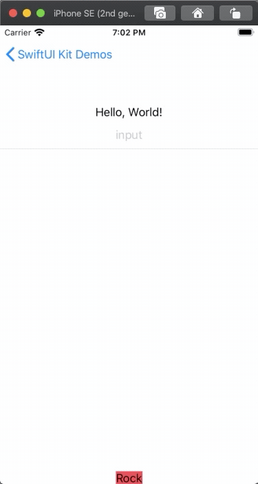

# SwiftUIKit

A collection of components that will simplify and accelerate your iOS development.

## Components

1. [CurrencyTextField](#1-currencytextfield)
1. [AdaptToKeyboard](#2-adapttokeyboard)
1. [ContactPicker](#3-contactpicker)

## Demo

There is an example app at `SwiftUIKitExampleApp` which can be built and run. Just clone this repo and run it.

# 1. CurrencyTextField

## Demo


## Description

Real time formatting of users input into currency format.

## Usage

```swift
import SwiftUIKit

struct ContentView: View {
    @State private var value = 0.0

    var body: some View {
        CurrencyTextField("Amount", value: self.$value)
            .font(.largeTitle)
            .multilineTextAlignment(TextAlignment.center)
    }
}
```

# 2. AdaptToKeyboard

## Demo



## Description

Animate view's position when keyboard is shown / hidden

## Usage

```swift
import SwiftUIKit

struct ContentView: View {
    var body: some View {
        VStack {
            Spacer()
            Button(action: {}) {
              Text("Hi")
                  .adaptToKeyboard()
            }
        }
    }
}
```

# 3. ContactPicker

## Demo


## Description

SwiftUI doesn't work well with `CNContactPickerViewController` if you just put it inside a `UIViewControllerRepresentable`. See this [stackoverflow post](https://stackoverflow.com/questions/57246685/uiviewcontrollerrepresentable-and-cncontactpickerviewcontroller/57621666#57621666). With `ContactPicker` here its just a one liner.

To enable multiple selection use `onSelectContacts` instead.

## Usage

```swift
import SwiftUIKit

struct ContentView: View {
    @State var showPicker = false

    var body: some View {
        ZStack {
            // This is just a dummy view to present the contact picker,
            // it won't display anything, so place this anywhere.
            // Here I have created a ZStack and placed it beneath the main view.
            ContactPicker(
                showPicker: $showPicker,
                onSelectContact: {c in
                    self.contact = c
                }
            )
            VStack {
                Button(action: {
                    self.showPicker.toggle()
                }) {
                    Text("Pick a contact")
                }
            }
        }
    }
}
```
